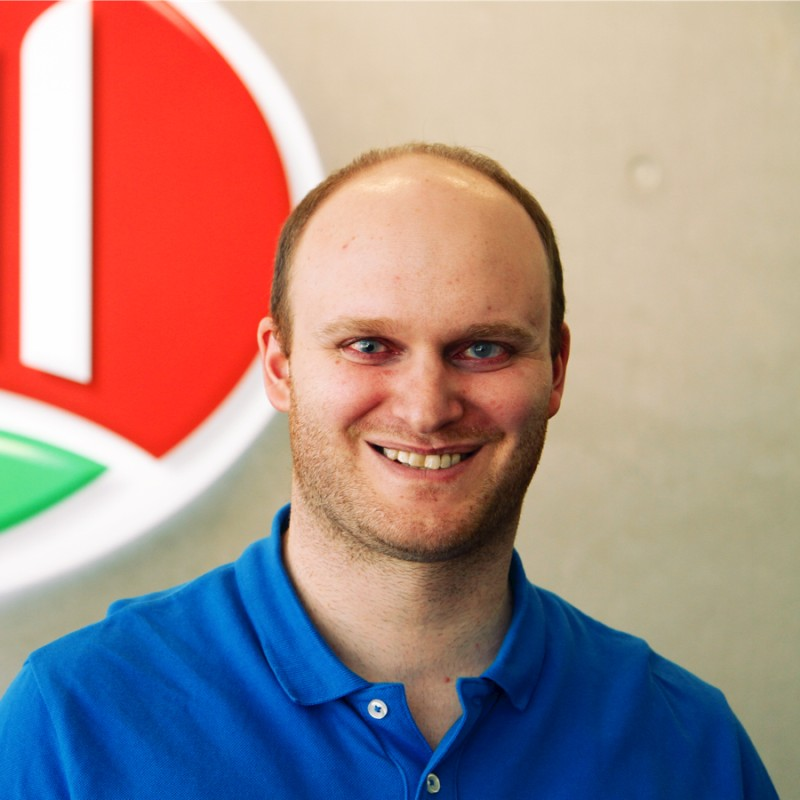
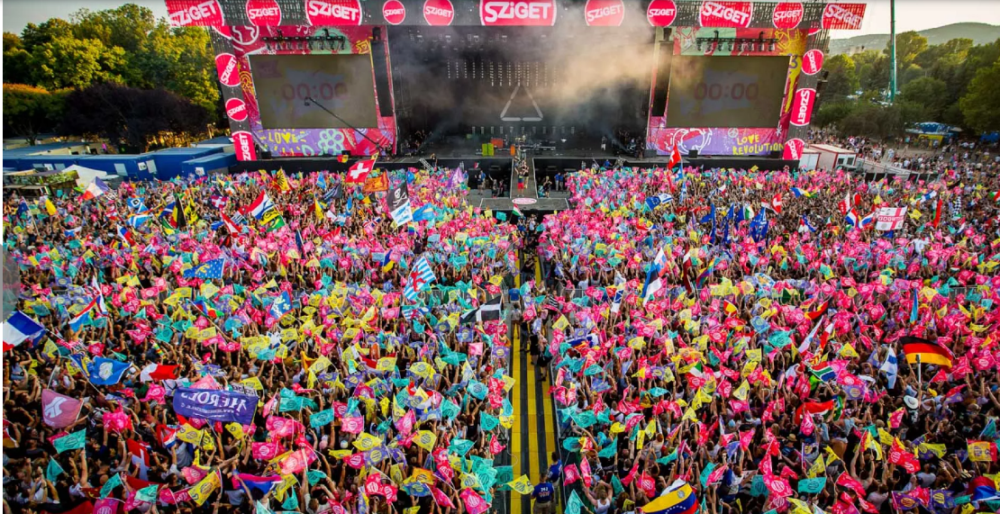

# 
 START Hack 2024 - Bell Food Group Case 

???Bilder vom Preis???

## 
 Case Introduction: 

### Problem
"Healthy and happy employees are good employees". This guiding principle is very important to us - a sustainable company that operates throughout Europe.
There is a lot of change in today's VUCA world. Everything is changing, there is a lot of hustle and bustle and influencing factors from all sides.

As an employer, we are obliged to fulfil our responsibility towards our employees in this environment. The difficulty in our group lies on the one hand in the geographical expansion and on the variety of multiple locations and cultures on the other hand. A great deal of coordination is required to do justice to all people and their health and well-being needs.

We would like to support our employees in the following factors wherever possible: 
-	health
-	nutrition
-	exercise
-	well-being
-	work place design
-	resilience
-	mindfulness
-	social interactions
-	and much more

### Expected Final Product
We expect a virtual coach as a companion for our employees. It is important to note that we have employees in the administration as well as in the production environment. This coach should be a daily companion for everydays life which can be used during work or leisure time.
####	Functionalities
It should be possible to divide the range of functions into two main areas:
#####	Function 1: Vital-Mentor 
Employees receive support in the areas described above, suggestions, advice and assistance. This should be implemented as counselling, coaching or general support with knowledge, experience, etc.
#####	Function 2: Persona-Sim / Avatar
The avatar reacts to the behavior, interactions and inputs of the employees and simulates the result. It shows the behavior directly as a reflection and hanges based on the behavior, input and interactions with other people. "What if" questions should also be asked and simulated.
####	Dimensions
Two dimensions should be considered in the solution
#####	Dimension 1: Personal
The focus lies on the personal perspective with its own benefits and further development for the individual. The utilization should be designed in such a way that it constantly motivates the user with various challenges and playful elements. The learning factor should not be neglected either.
#####	Dimension 2: Social
The social aspect between employees must also be considered and is very important. It should be possible to interact and exchange ideas with other employees. What this mutual interaction between employees should look like is totally up to you and is not predetermined.

## Data
Any available data sources are conceivable. It can be various data on nutrition, health, workouts etc. which are available. We provide an anonymized data set of a typical plant with the following information:
-	number of employees
-	age structure
-	mapping of the organization

### Technology
The technology for development is not defined. The only requirement is that the application works on standard smartphones and can be used by 15,000+ users during operation.

## 
 The Pitch: 

Here you will find the presentation:

## 
 Deep Dive Slides: 

Here you will find the detailed Information from the deep dive presentation:

## 
 Further Information: 

The Bell Food Group is a manufacturing company within the food industry. In fact, we are one of the leading processors of meat and convenience products in Europe as well as a market leader in Switzerland. Our sites are spread across 15 countries within Europe. 
he cultures are very different and so are the various fields of activity of the employees. It is important to us that the solution is designed in such a way that it can be used by all our employees in various departments and across all levels.

##  
 Resources: 

-	For a detailed insight into our business here is the Annual report Bell Food Group 2023 "LINK"
-	Here is the dataset with the example Information about the Personal structure in one of our sites "LINK"
  
## 
 Judging Criteria: 
 

### Presentation delivered (40 %)
- The presentation is understandable and visually appealing
- The pitch is delivered in the given time
- The pitch is well done, understandable and engaging

### Execution of the requirements (20 %)
- The functionalities are implemented
- The dimensions are implemented
- The requirements for the functions are fulfilled

### Creativity, innovation and vision (30 %)
- Design
- Solution ideas
- Creativity
- Technologies used

### User-friendliness (10 %)
- Operation of the application
- Design of the application

## 
 Point of Contact: 
 

 Sven Friedli, CIO, [LinkedIn](https://www.linkedin.com/in/sven-friedli-454265121/), [Mail](mailto:Sven.Friedli@bellfoodgroup.com)

 Maria Horvath, Talent Acquisition Manager, [LinkedIn](https://www.linkedin.com/in/horvathmaria/), [Mail](mailto:Maria.horvath@bellfoodgroup.com)

 Markus Ettlin, Head of Smart Technologies, [LinkedIn](https://www.linkedin.com/in/markusettlin/), [Mail](mailto:markus.ettlin@bellfoodgroup.com)

Also with us are Selina, Anabelle, Alessia, Daniel, Marco, Frank, and Alvaro

## 
 Prize - the winning team members will each receive: 

A weekend get-away trip to Budapest in Hungary to one of our production plants combined with tickets to the Sziget Festival in August 2024! 

   
